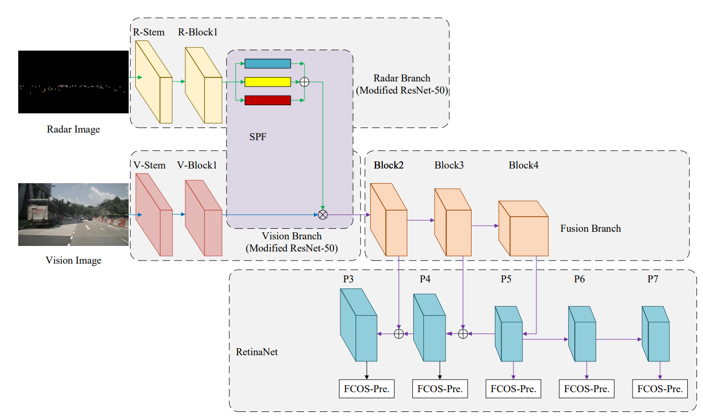
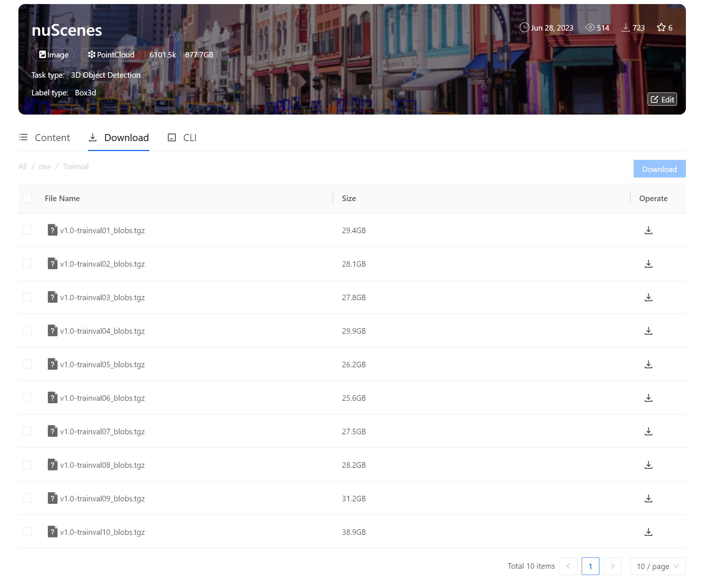
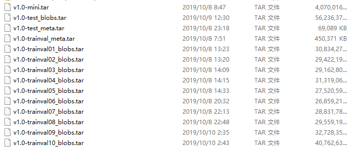
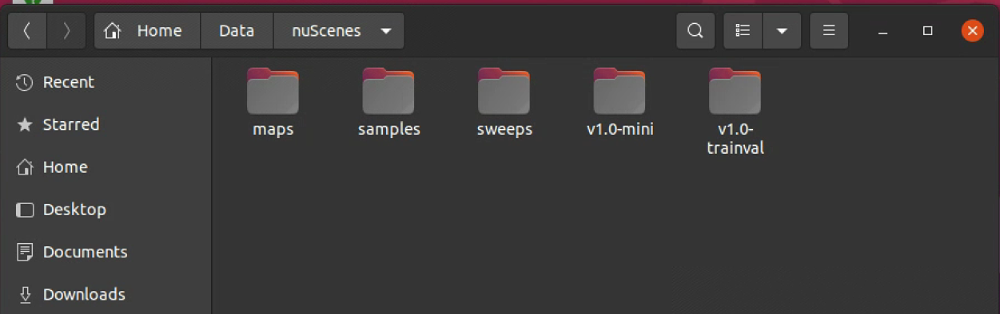
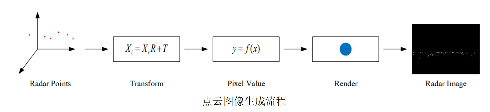
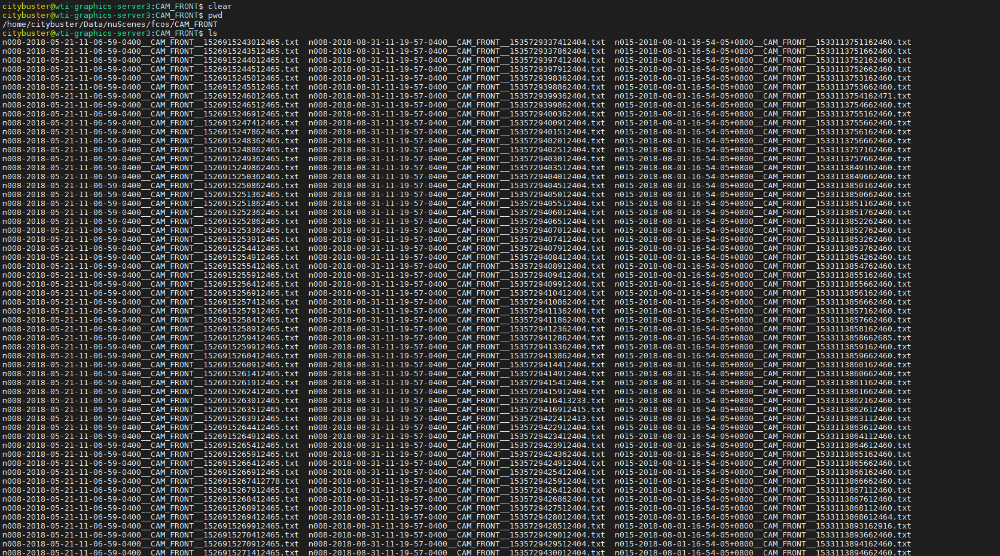
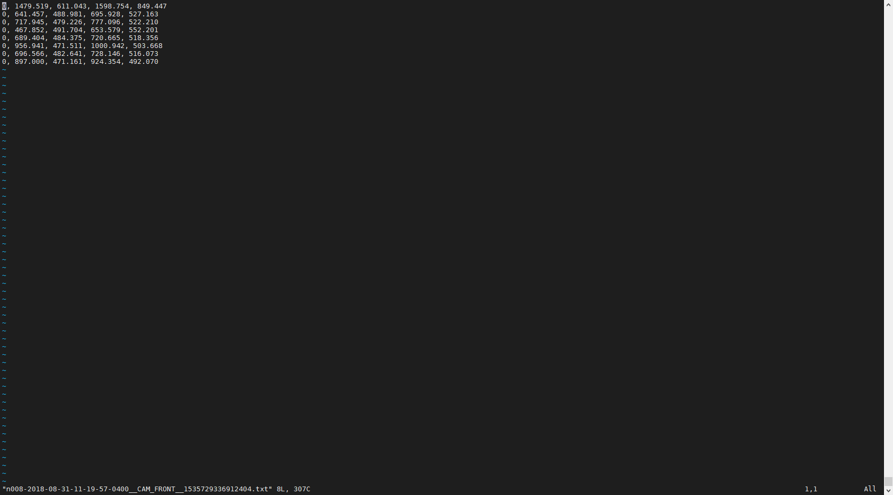
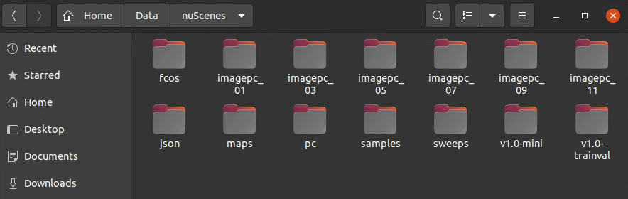
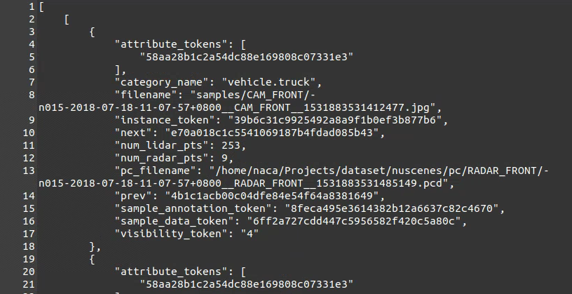
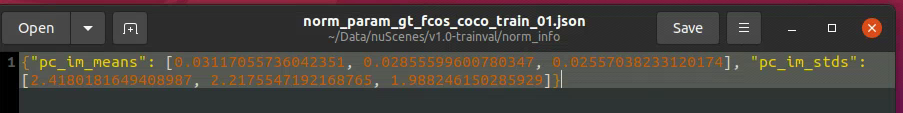

# SAF-FCOS: Spatial Attention Fusion for Obstacle Detection using MmWave Radar and Vision Sensor


The full paper is available at: [https://www.mdpi.com/1424-8220/20/4/956](https://www.mdpi.com/1424-8220/20/4/956).

## Arch


## Abstract: 

For autonomous driving, it is important to detect obstacles in all scales accurately for safety
consideration. In this paper, we propose a new spatial attention fusion (SAF) method for obstacle
detection using mmWave radar and vision sensor, where the sparsity of radar points are considered
in the proposed SAF. The proposed fusion method can be embedded in the feature-extraction stage,
which leverages the features of mmWave radar and vision sensor effectively. Based on the SAF,
an attention weight matrix is generated to fuse the vision features, which is different from the
concatenation fusion and element-wise add fusion. Moreover, the proposed SAF can be trained
by an end-to-end manner incorporated with the recent deep learning object detection framework.
In addition, we build a generation model, which converts radar points to radar images for neural
network training. Numerical results suggest that the newly developed fusion method achieves
superior performance in public benchmarking. In addition, the source code will be released in
the GitHub.

## You should known

Please read the FCOS project first [FCOS-README.md](FCOS-README.md)

## Installation

Please check [INSTALL.md](INSTALL.md) for installation instructions.

## Download Data

### Version1: download from opendatalab(推荐)
[opendatalab reference](https://opendatalab.com/nuScenes/cli)


### Version2: download from official website

1. Please download Full dataset (v1.0) of nuScenes dataset from the [link](https://www.nuscenes.org/download)




2. Then, upload all download tar files to an ubuntu server, and uncompress all *.tar files in a specific folder:

```shell
mkdir ~/Data/nuScenes
mv AllDownloadTarFiles ~/Data/nuScenes
cd ~/Data/nuScenes
for f in *.tar; do tar -xvf "$f"; done
```

## Generate Data
1. Data: you should merge all 10 blobs and re-organize the dataset into the following format:



2. Convert the radar pcd file as image:

```shell
python tools/nuscenes/convert_radar_point.py --dataroot ~/Data/nuScenes
```



3. Calculate the norm info of radar images:

```shell
python tools/nuscenes/extract_pc_image_norm_info_from_image.py --datadir ~/Data/nuScenes --outdir ~/Data/nuScenes/v1.0-trainval
```

4. Generate 2D detections results for nuScenes CAM_FRONT images by 'FCOS_imprv_dcnv2_X_101_64x4d_FPN_2x.pth',   
   some of detection results should be refined by labelers to get tighter bboxes,   
   and save the detection results as txt file in the folder ~/Data/nuScenes/fcos/CAM_FRONT:  





   The detection results are saved as '0, 1479.519, 611.043, 1598.754, 849.447'. The first column is category, and the
   last stands for position.  
   For convenience, we supply our generated 2D txt files in cloud drive and in folder data/fcos.zip.  
   For users not in China, please download
   from [google drive](https://drive.google.com/file/d/12SXDFUWpTPUKaWTn8yuoG-_CHaXVVGB7/view?usp=sharing).  
   For users in China, please download from [baidu drive](https://pan.baidu.com/s/11NNYpmBbs5sSqSsFxl-z7Q).
   ```shell
   链接：https://pan.baidu.com/s/11NNYpmBbs5sSqSsFxl-z7Q 
   提取码：6f1x 
   ```

   If you use our generated txt files, please:

```shell
mv fcos.zip ~/Data/nuScenes
unzip fcos.zip
```

5. Generate 2D annotations in coco style for model training and test:

```shell
python tools/nuscenes/generate_2d_annotations_by_fcos.py --datadir ~/Data/nuScenes --outdir ~/Data/nuScenes/v1.0-trainval
```

### Final data architecture



```
Home/naca/Data
├── nuScenes/
|   |——fcos/
|   |——imagepc_01/
|   |   |——RADAR_FRONT/
|   |   |  |——*json
|   |   |  |——*.png
|   |——imagepc_03/
|   |   |——RADAR_FRONT/
|   |   |  |——*json
|   |   |  |——*.png
|...
|   |——pc/
|   |   |——RADAR_FRONT/
|   |   |  |——*.pcd
|   |——json/
|   |   |——CAM_FRONT/
|   |   |  |——*.json
│   │   ├── maps/
│   │   ├── samples/
│   │   ├── sweeps/
│   │   ├── v1.0-mini/
|   |   ├── v1.0-trainval/
|   |   | ├── *.json
|   |   | ├── gt_fcos_coco_train.json
|   |   | ├── gt_fcos_coco_val.json
|   |   | ├── image_pc_annotations.json
|   |   | ├── norm_info/
|  |    |   ├── norm_param_gt_fcos_coco_train_03.json
|  |    |   ├── norm_param_gt_fcos_coco_train_05.json
|  |    |   ├── norm_param_gt_fcos_coco_train_07.json
|  |    |   ├── norm_param_gt_fcos_coco_train_09.json
|———————————|—— norm_param_gt_fcos_coco_train_11.json
```
### Some key files' screen shot
- image_pc_annotations.json



- /norm_info/*.json



## Prepare training

The following command line will train fcos_imprv_R_50_FPN_1x_ATTMIX_135_Circle_07.yaml on 2 GPUs with Synchronous
Stochastic Gradient Descent (SGD):

```shell
python -m torch.distributed.launch \
       --nproc_per_node=2 \
       --master_port=$((RANDOM + 10000)) \
       tools/train_net.py \
       --config-file configs/fcos_nuscenes/fcos_imprv_R_50_FPN_1x_ATTMIX_135_Circle_07.yaml \
       DATALOADER.NUM_WORKERS 2 \
       OUTPUT_DIR tmp/fcos_imprv_R_50_FPN_1x
```

## Network Architecture

### Radar branch 


### Image branch & Fusion branch


### make_fcos_loss_evaluator


## Prepare Test

### Checkpoints
- You should download checkpoints and move to `your_project/ckpts`

1. [fcos_imprv_R_50_FPN_1x_ATTMIX_135_Circle_07.yaml](https://pan.baidu.com/s/1XO64KxpGqfLhlPY6McXkpQ), 提取码：`bp0h`, followings are checkpoints performance log:

```bash
 Average Precision  (AP) @[ IoU=0.50:0.95 | area=   all | maxDets=100 ] = 0.662
 Average Precision  (AP) @[ IoU=0.50      | area=   all | maxDets=100 ] = 0.894
 Average Precision  (AP) @[ IoU=0.75      | area=   all | maxDets=100 ] = 0.728
 Average Precision  (AP) @[ IoU=0.50:0.95 | area= small | maxDets=100 ] = 0.484
 Average Precision  (AP) @[ IoU=0.50:0.95 | area=medium | maxDets=100 ] = 0.649
 Average Precision  (AP) @[ IoU=0.50:0.95 | area= large | maxDets=100 ] = 0.775
 Average Recall     (AR) @[ IoU=0.50:0.95 | area=   all | maxDets=  1 ] = 0.125
 Average Recall     (AR) @[ IoU=0.50:0.95 | area=   all | maxDets= 10 ] = 0.616
 Average Recall     (AR) @[ IoU=0.50:0.95 | area=   all | maxDets=100 ] = 0.739
 Average Recall     (AR) @[ IoU=0.50:0.95 | area= small | maxDets=100 ] = 0.602
 Average Recall     (AR) @[ IoU=0.50:0.95 | area=medium | maxDets=100 ] = 0.735
 Average Recall     (AR) @[ IoU=0.50:0.95 | area= large | maxDets=100 ] = 0.822
Maximum f-measures for classes:
[0.837035054856837]
Score thresholds for classes (used in demos for visualization purposes):
[0.5025295615196228]
2023-06-28 08:26:46,891 fcos_core.inference INFO: OrderedDict([('bbox', OrderedDict([('AP', 0.6622987526290007), ('AP50', 0.893780659927815), ('AP75', 0.7280925007150355), ('APs', 0.48447696873607443), ('APm', 0.6485033130717023), ('APl', 0.7745259549635619)]))])
INFO:fcos_core.inference:OrderedDict([('bbox', OrderedDict([('AP', 0.6622987526290007), ('AP50', 0.893780659927815), ('AP75', 0.7280925007150355), ('APs', 0.48447696873607443), ('APm', 0.6485033130717023), ('APl', 0.7745259549635619)]))])
```

The following command line will test fcos_imprv_R_50_FPN_1x_ATTMIX_135_Circle_07 on 2 GPUs:

```shell
python -m torch.distributed.launch \
       --nproc_per_node=2  
       --master_port=$((RANDOM + 10000)) \
       tools/test_epoch.py \
       --config-file configs/fcos_nuscenes/fcos_imprv_R_50_FPN_1x_ATTMIX_135_Circle_07.yaml \
       --checkpoint-file ckpts/fcos_imprv_R_50_FPN_1x_ATTMIX_135_Circle_07.pth \ 
       OUTPUT_DIR tmp/fcos_imprv_R_50_FPN_1x_ATTMIX_135_Circle_07
```

### Test pipeline


## Citations

Please consider citing our paper and FOCS in your publications if the project helps your research. BibTeX reference is
as follows.

```
@article{chang2020spatial,
  title={Spatial Attention fusion for obstacle detection using mmwave radar and vision sensor},
  author={Chang, Shuo and Zhang, Yifan and Zhang, Fan and Zhao, Xiaotong and Huang, Sai and Feng, Zhiyong and Wei, Zhiqing},
  journal={Sensors},
  volume={20},
  number={4},
  pages={956},
  year={2020},
  publisher={Multidisciplinary Digital Publishing Institute}
}
@inproceedings{tian2019fcos,
  title   =  {{FCOS}: Fully Convolutional One-Stage Object Detection},
  author  =  {Tian, Zhi and Shen, Chunhua and Chen, Hao and He, Tong},
  booktitle =  {Proc. Int. Conf. Computer Vision (ICCV)},
  year    =  {2019}
}
```